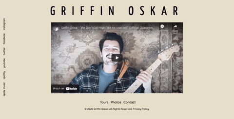

# Griffin Oskar's Artist Website
  

<a href="https://katnguyenn.github.io/Griffin-Oskar/">Click here to see it in action.</a>

## Table of Contents
* [Description](#description)
* [Installation](#installation)
* [Usage](#usage)
* [License](#license)
* [Contributions](#contributions)
* [Tests](#tests)
* [Questions](#questions)

## Description 
*Overview of this project:*  
We set out to give a pop artist by the name of Griffin Oscar a place where fans can go to find out all of his latest information. Griffin is an amazing artist and producer with millions of streams on his songs but he did not have a website to link everything together. The goal for his site was to give him a place for fans, labels and managers to be able to find out everything there is to know about Griffin. He also wanted to start a mailing list and give tour updates.
 

* The page contains HTML, CSS, Materialize (CSS Framework), Javascript, jQuery and Node. 
* The page is responsive. 
* APIs - The page utilizes two 3rd party APIs
    1. First, the Bands In Town API to pull all of Griffin's latest dates.
    2. Second, Mailchimp to generate Griffin's sign-up sheet for his newsletter.
* The images are set up in a carousel and when you click "Images" in the menue the carousel will pop up in a modal. When you click on the images they will cycle through the carousel.  

## Installation
*Steps required to install project and get the development environment established:*
* Simply clone this repo to get all the code for the project. You will need to register your own Mailchimp and Bands In Town API keys.

## Usage
*Instructions and examples for use:* 
* This is a one page website high-lighting Oskar's latest music video front and center. 
* At the bottom of the page you will find the menu bar containing Tour Dates, Contact, and Images. 
    1. The images are set up in a carousel and when you click "Images" in the menue the carousel will pop up in a modal. When you click on the images they will cycle through the carousel.
    2. Tour - when you click "Tour" a modal will pop up with the latest tour dates. If there are no upcoming dates then it will populate a message telling fans to check back at a later date. 
    3. Conact - populates a sign-up page generated by mailchimp using the mailchimp api and Node.  

## License 
* Built under the MIT licence.

## Credits
* Built & designed by Tomara Petty, Markos Escalante, Lili Cohen and Kat Nguyen.

## Test
* No tests required. 

## Questions?

 

#### If you have any questions or want to make a contribution please reach out to us here:
 

**GitHub:** 
* @tomarapetty 
* @lilipcohen 
* @markos-escalante 
* @katnguyenn  

**Email:** 
* nguyenkat01@yahoo.com
* tomararuth@gmail.com 
* lili.cohen.tv@gmail.com 
* escalante.markos18@gmail.com  

**LinkedIn:** 
* Tomara: https://www.linkedin.com/in/tomara-petty/ 
* Lili: http://www.linkedin.com/in/lili-cohen-78a93a1b3 
* Kat: https://www.linkedin.com/in/katherine-nguyen-205a7b13a/ 
* Markos: https://www.linkedin.com/feed/

